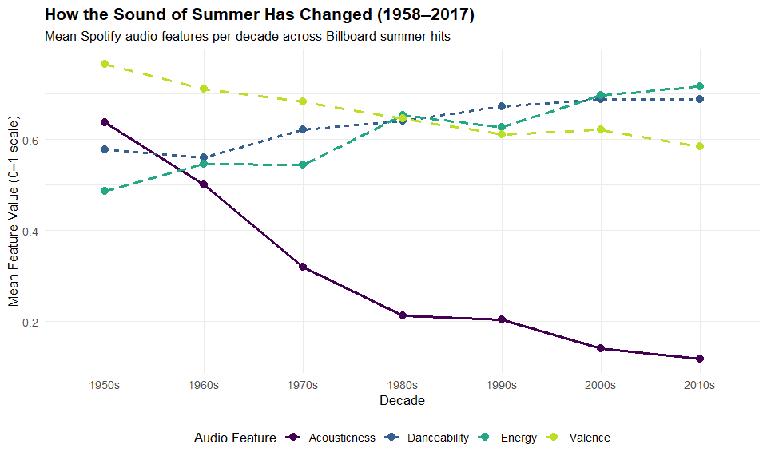
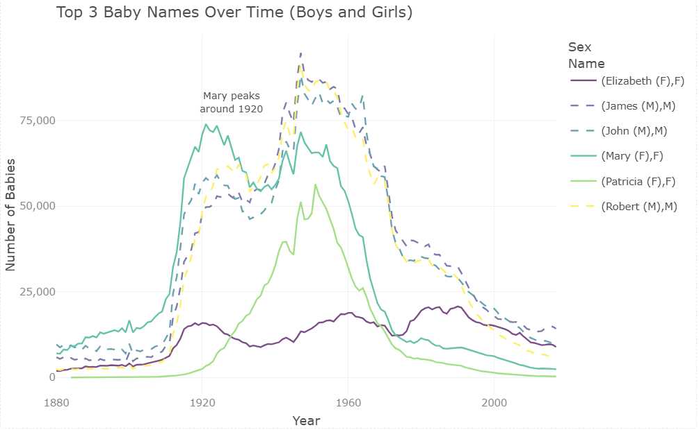
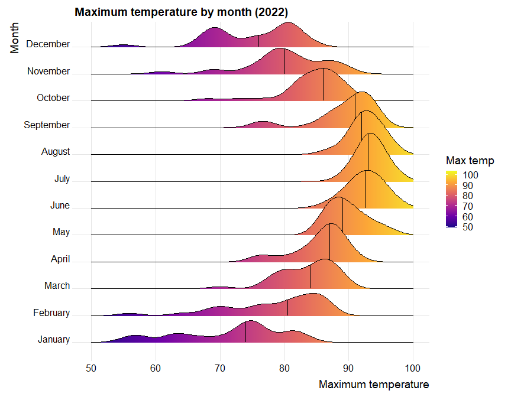

# Data Visualization and Reproducible Research

> Jan Tietz.

## Project 1: The Sound of Summer (Billboard Summer Hits, 1958–2017)

This mini-project explores Spotify audio features for songs that appeared on the
Billboard summer charts across six decades. It looks at how the sound of popular summer
music changed over time, which artists dominated the charts, and how features such as
danceability, energy, and valence relate to one another.

**Data:** `all_billboard_summer_hits.csv`, with audio features (danceability, energy,
valence, tempo, loudness, acousticness) plus track, artist, and year for each summer hit.

**Favorite chart:** the decade trend line chart, because it surfaced the most surprising
finding: summer hits keep getting more energetic and danceable, but their valence
(positivity) actually peaks in the 1970s and declines afterward.

**Required elements (where addressed):**

- Interactive: plotly version of the danceability vs energy scatterplot with hover details (Viz 5).
- Accessibility: colorblind-safe viridis palettes and alt text on all figures, plus line type on the trend chart so the series do not rely on color alone.
- Redesign (before/after): the danceability boxplot, changed from a Spectral rainbow palette to viridis, shown as before/after in the report (Viz 3).

Full report and detailed change log in the `project_01/` folder.

## Project 02: Baby Names, Florida Lakes, and House Values
In this project, I explored three different visualization types in one report: how baby
naming trends shift over time, how Florida's lakes are distributed across the state, and
whether house size predicts assessed value. All color choices were made with accessibility
in mind, since I have deuteranopia. Find the code and report in the `project_02/` folder.

**Favorite chart:** the interactive baby names timeline, because it shows the long naming
waves at a glance and lets the reader hover to pull up the exact count for any name and
year. It also doubles as my before/after redesign.

**Required elements (where addressed):**
- Interactive: a plotly line chart of the top baby names with hover details, and a leaflet map of Florida lakes with zoom, pan, and per-lake tooltips (Plot 1 and Plot 2).
- Accessibility: colorblind-safe viridis palettes and alt text on all figures, plus line type on Plot 1 so the series do not rely on color alone.
- Redesign (before/after): the original version of Plot 1 (Paired palette, sex by color only) shown against the improved version, with an explanation in the report.

Full report and detailed change log in the `project_02/` folder.

## Project 3: Exploratory Data Visualization (Weather & Concrete)

This project reproduces a set of given charts to practice new visualization types and
then explores a second dataset of my choice.

**Part 1 (TPA weather, 2022):** density and distribution plots of daily maximum
temperatures, including faceted histograms, single and faceted density plots, and a
ridgeline plot.

**Part 2 (Concrete strength):** an exploration of the UCI concrete dataset, looking at
how compressive strength relates to age and to the mix ingredients (cement, water).

**Required elements and where to find them:**

- **Interactive chart:** a `plotly` bubble plot of strength vs cement (hover shows the cement, water, age, and strength of each mix), in the Part 2 section.
- **Accessibility:** colorblind-safe viridis palettes throughout, alt text on every figure, and ordered scales instead of color-only encoding.
- **Redesign (before / after):** a boxplot of strength by age, changed from the default rainbow-like palette to the ordered, colorblind-safe viridis scale, shown as a before/after in Part 2.

**Favorite chart:** the ridgeline plot of monthly maximum temperatures, because it shows
all twelve monthly distributions stacked in one compact view and makes the seasonal shift
from cool, spread-out winters to warm, narrow summers immediately visible.

Data sources: TPA weather 2022 (FSU Florida Climate Center) and the concrete dataset
(UCI Machine Learning Repository). Full report in the `project_03/` folder.

### Moving Forward

This project covered interactive charts (plotly, leaflet), colorblind-safe
palettes (viridis), alt text, and a reproducible github_document workflow. The
accessibility part was directly relevant to me, since I have deuteranopia, and a
colorblind-safe palette plus a second encoding is now my default.

I plan to apply these principles to my data analysis work in consulting, where
the goal is to turn data into clear stories for decision makers.