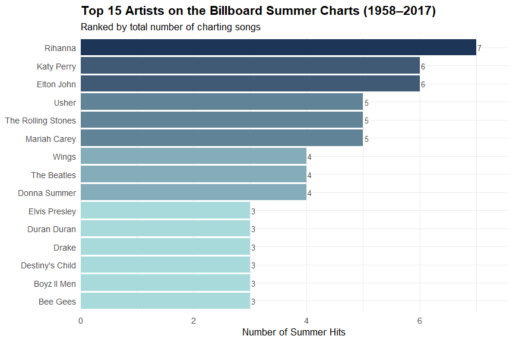
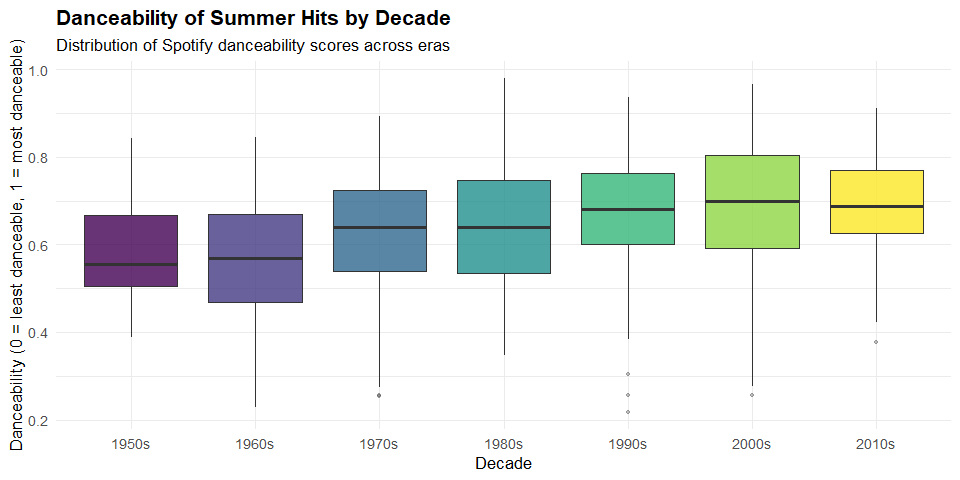
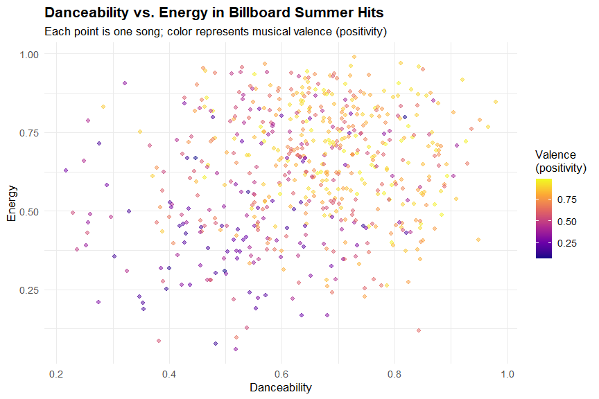
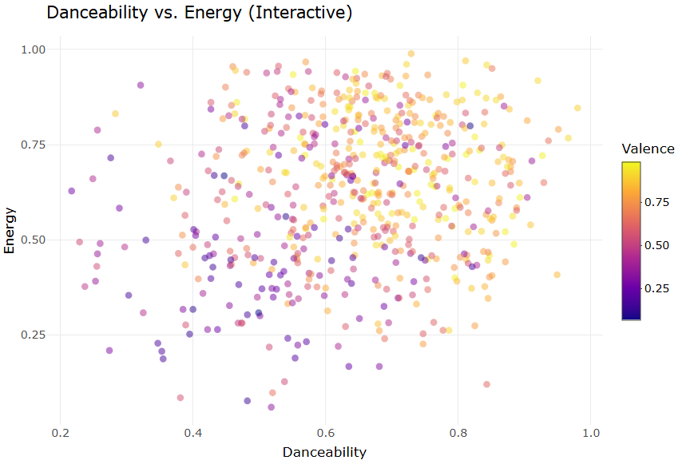

Data Visualization - Mini-Project 1
================
Jan Tietz `jtietz3060@floridapoly.edu`

## Introduction

This report explores the **Billboard Summer Hits dataset (1958–2017)**,
which contains Spotify audio features for songs that appeared on the
Billboard summer charts over six decades. The dataset includes acoustic
properties such as danceability, energy, valence, tempo, and loudness,
alongside metadata like artist name, track name, and year.

The goal is to uncover how the sound of popular summer music has changed
over time, which artists dominated the charts, and how different audio
features relate to each other.

------------------------------------------------------------------------

## Setup and Data Loading

``` r
library(tidyverse)
library(plotly)

billboard <- read_csv("../data/all_billboard_summer_hits.csv")
```

------------------------------------------------------------------------

## Data Exploration

``` r
# Overview of the dataset
glimpse(billboard)
```

    ## Rows: 600
    ## Columns: 22
    ## $ danceability     <dbl> 0.518, 0.543, 0.541, 0.408, 0.554, 0.679, 0.663, 0.68…
    ## $ energy           <dbl> 0.060, 0.332, 0.676, 0.397, 0.189, 0.279, 0.619, 0.55…
    ## $ key              <chr> "A#", "C", "C", "A", "E", "G", "F#", "B", "C", "G", "…
    ## $ loudness         <dbl> -14.887, -11.573, -7.988, -12.536, -14.277, -10.386, …
    ## $ mode             <chr> "major", "major", "major", "major", "major", "major",…
    ## $ speechiness      <dbl> 0.0441, 0.0317, 0.1350, 0.0300, 0.0279, 0.0384, 0.033…
    ## $ acousticness     <dbl> 0.9870, 0.6690, 0.1880, 0.8730, 0.9150, 0.6450, 0.336…
    ## $ instrumentalness <dbl> 7.87e-06, 0.00e+00, 8.03e-01, 0.00e+00, 1.37e-05, 0.0…
    ## $ liveness         <dbl> 0.1610, 0.1340, 0.1230, 0.2800, 0.1320, 0.1180, 0.062…
    ## $ valence          <dbl> 0.336, 0.795, 0.911, 0.697, 0.214, 0.854, 0.979, 0.86…
    ## $ tempo            <dbl> 127.870, 154.999, 76.231, 72.615, 136.714, 117.287, 1…
    ## $ track_uri        <chr> "006Ndmw2hHxvnLbJsBFnPx", "5ayybTSXNwcarDtxQKqvWX", "…
    ## $ duration_ms      <dbl> 216373, 153933, 128360, 162773, 165293, 161253, 15060…
    ## $ time_signature   <dbl> 4, 4, 4, 4, 3, 3, 4, 4, 4, 4, 3, 4, 4, 4, 4, 4, 4, 3,…
    ## $ key_mode         <chr> "A# major", "C major", "C major", "A major", "E major…
    ## $ playlist_name    <chr> "summer_hits_1958", "summer_hits_1958", "summer_hits_…
    ## $ playlist_img     <chr> "https://mosaic.scdn.co/640/5e8c49f7a8d161c1d6510999b…
    ## $ track_name       <chr> "Nel blu dipinto di blu", "Poor Little Fool", "Patric…
    ## $ artist_name      <chr> "Domenico Modugno", "Ricky Nelson", "Pérez Prado", "T…
    ## $ album_name       <chr> "Tutto Modugno (Mister Volare)", "Ricky Nelson (Expan…
    ## $ album_img        <chr> "https://i.scdn.co/image/5e8c49f7a8d161c1d6510999bd86…
    ## $ year             <dbl> 1958, 1958, 1958, 1958, 1958, 1958, 1958, 1958, 1958,…

``` r
# Check for missing values per column
billboard %>%
  summarise(across(everything(), ~ sum(is.na(.)))) %>%
  pivot_longer(everything(), names_to = "variable", values_to = "missing") %>%
  filter(missing > 0)
```

    ## # A tibble: 0 × 2
    ## # ℹ 2 variables: variable <chr>, missing <int>

There are no missing values in the dataset.

``` r
# Summary of key numeric audio features
billboard %>%
  select(year, danceability, energy, valence, tempo, loudness, acousticness) %>%
  summary()
```

    ##       year       danceability        energy          valence      
    ##  Min.   :1958   Min.   :0.2170   Min.   :0.0600   Min.   :0.0695  
    ##  1st Qu.:1973   1st Qu.:0.5457   1st Qu.:0.4768   1st Qu.:0.4790  
    ##  Median :1988   Median :0.6480   Median :0.6405   Median :0.6900  
    ##  Mean   :1988   Mean   :0.6407   Mean   :0.6221   Mean   :0.6488  
    ##  3rd Qu.:2002   3rd Qu.:0.7402   3rd Qu.:0.7830   3rd Qu.:0.8482  
    ##  Max.   :2017   Max.   :0.9800   Max.   :0.9890   Max.   :0.9860  
    ##      tempo           loudness        acousticness      
    ##  Min.   : 62.83   Min.   :-23.574   Min.   :0.0000488  
    ##  1st Qu.:100.22   1st Qu.:-10.947   1st Qu.:0.0417250  
    ##  Median :120.01   Median : -8.072   Median :0.1620000  
    ##  Mean   :120.48   Mean   : -8.587   Mean   :0.2665156  
    ##  3rd Qu.:133.84   3rd Qu.: -5.862   3rd Qu.:0.4472500  
    ##  Max.   :210.75   Max.   : -1.097   Max.   :0.9870000

``` r
# Add a decade column for grouped analysis
billboard <- billboard %>%
  mutate(decade = paste0(floor(year / 10) * 10, "s"))
```

------------------------------------------------------------------------

## Visualization 1: Audio Feature Trends Over Time

**What story does this tell?** Summer hits have become progressively
louder, more energetic, and less acoustic since the 1950s. Valence
(musical “happiness”) shows interesting variation, peaking in the 1970s
and 1980s before declining slightly in recent decades.

``` r
#NEW
feature_trends <- billboard %>%
  group_by(decade) %>%
  summarise(
    Danceability = mean(danceability, na.rm = TRUE),
    Energy       = mean(energy, na.rm = TRUE),
    Valence      = mean(valence, na.rm = TRUE),
    Acousticness = mean(acousticness, na.rm = TRUE)
  ) %>%
  pivot_longer(-decade, names_to = "feature", values_to = "mean_value")

ggplot(feature_trends, aes(x = decade, y = mean_value,
                           color = feature, group = feature,
                           linetype = feature)) +
  geom_line(linewidth = 1.2) +
  geom_point(size = 3) +
  scale_color_viridis_d(end = 0.9) +
  labs(
    title    = "How the Sound of Summer Has Changed (1958–2017)",
    subtitle = "Mean Spotify audio features per decade across Billboard summer hits",
    x        = "Decade",
    y        = "Mean Feature Value (0–1 scale)",
    color    = "Audio Feature",
    linetype = "Audio Feature"
  ) +
  theme_minimal(base_size = 13) +
  theme(
    plot.title    = element_text(face = "bold"),
    legend.position = "bottom"
  )
```


I replaced the original Set2 palette with the colorblind-safe viridis
scale, and each feature is also encoded by line type so the four series
stay distinguishable without relying on color alone. —

## Visualization 2: Top 15 Artists by Number of Summer Hits

**What story does this tell?** A small group of artists account for a
disproportionately large share of summer chart appearances. Examining
this reveals which artists have had the longest-lasting commercial
relevance in the summer season.

``` r
top_artists <- billboard %>%
  count(artist_name, sort = TRUE) %>%
  slice_head(n = 15)

ggplot(top_artists, aes(x = reorder(artist_name, n), y = n, fill = n)) +
  geom_col(show.legend = FALSE) +
  geom_text(aes(label = n), hjust = -0.3, size = 3.5, color = "grey30") +
  coord_flip() +
  scale_fill_gradient(low = "#a8dadc", high = "#1d3557") +
  scale_y_continuous(expand = expansion(mult = c(0, 0.08))) +
  labs(
    title    = "Top 15 Artists on the Billboard Summer Charts (1958–2017)",
    subtitle = "Ranked by total number of charting songs",
    x        = NULL,
    y        = "Number of Summer Hits"
  ) +
  theme_minimal(base_size = 13) +
  theme(plot.title = element_text(face = "bold"))
```


The single-hue blue gradient varies only in lightness and is already
colorblind-safe, so I kept it. I added a numeric label at the end of
each bar so the exact hit counts are readable without having to estimate
bar length. —

## Visualization 3: Distribution of Danceability by Decade

**What story does this tell?** The distribution of danceability scores
has shifted noticeably across decades. Modern hits cluster at higher
danceability values, whereas tracks from the 1950s and 1960s show wider
spread and lower medians, reflecting the shift from acoustic pop toward
rhythm-driven genres.

``` r
ggplot(billboard, aes(x = decade, y = danceability, fill = decade)) +
  geom_boxplot(alpha = 0.8, outlier.alpha = 0.3, outlier.size = 1) +
    scale_fill_viridis_d() +
  labs(
    title    = "Danceability of Summer Hits by Decade",
    subtitle = "Distribution of Spotify danceability scores across eras",
    x        = "Decade",
    y        = "Danceability (0 = least danceable, 1 = most danceable)"
  ) +
  theme_minimal(base_size = 13) +
  theme(
    plot.title      = element_text(face = "bold"),
    legend.position = "none"
  )
```


I replaced the Spectral rainbow palette with the colorblind-safe viridis
scale. The decade is also shown and labeled on the x-axis, so the fill
is purely decorative and no meaning depends on color alone.\* —

## Visualization 4: Danceability vs. Energy, Colored by Valence

**What story does this tell?** This scatterplot reveals the relationship
between danceability and energy. Songs in the upper-right quadrant are
both danceable and high-energy, which tends to align with higher valence
(happier-sounding songs), though there is notable variety.

``` r
ggplot(billboard, aes(x = danceability, y = energy, color = valence)) +
  geom_point(alpha = 0.5, size = 1.8) +
  scale_color_viridis_c(option = "plasma", name = "Valence\n(positivity)") +
  labs(
    title    = "Danceability vs. Energy in Billboard Summer Hits",
    subtitle = "Each point is one song; color represents musical valence (positivity)",
    x        = "Danceability",
    y        = "Energy"
  ) +
  theme_minimal(base_size = 13) +
  theme(plot.title = element_text(face = "bold"))
```



This plot already uses the colorblind-safe viridis (plasma) scale, so I
kept it. Valence is a continuous variable, which a smooth color gradient
communicates well.

------------------------------------------------------------------------

## Visualization 5: Interactive Danceability vs. Energy

**What story does this tell?** This is the interactive version of the
scatterplot above. Hovering over any point reveals the song title,
artist, and exact feature values, so individual hits can be identified
rather than seen as anonymous dots.

``` r
interactive_scatter <- billboard %>%
  ggplot(aes(x = danceability, y = energy, color = valence,
             text = paste0("Song: ", track_name,
                           "<br>Artist: ", artist_name,
                           "<br>Danceability: ", round(danceability, 2),
                           "<br>Energy: ", round(energy, 2),
                           "<br>Valence: ", round(valence, 2)))) +
  geom_point(alpha = 0.5, size = 1.8) +
  scale_color_viridis_c(option = "plasma", name = "Valence") +
  labs(
    title = "Danceability vs. Energy (Interactive)",
    x     = "Danceability",
    y     = "Energy"
  ) +
  theme_minimal(base_size = 13)

ggplotly(interactive_scatter, tooltip = "text")
```


This plot already uses the colorblind-safe viridis (plasma) scale, so I
kept it. Valence is a continuous variable, which a smooth color gradient
communicates well.

------------------------------------------------------------------------

## Discussion

### What were the original charts you planned to create for this assignment?

My original plan was:

1.  A line chart showing how the audio features have changed decade by
    decade. I wanted to see whether summer music has gotten more
    energetic or danceable over time, or whether that is mostly a
    feeling people have that the data might not back up.

2.  A bar chart of the most frequent artists. This one was basically
    always going to be in here. I was curious whether the same handful
    of names would dominate across six decades, or if it would be more
    spread out.

3.  Some kind of distribution plot, likely a boxplot, to look at
    danceability across different eras rather than just the mean.
    Averages can be misleading, and I wanted to see whether some decades
    had a wider variety of songs or whether everything converged toward
    a certain sound.

4.  A scatterplot comparing danceability and energy, which I thought
    would be visually interesting and might reveal some clustering by
    feel or mood.

------------------------------------------------------------------------

### What story could you tell with your plots?

Taken together, the four visualizations tell a pretty coherent story
about how popular summer music changed between 1958 and 2017. The short
version is: summer hits got louder, more beat-driven, and less acoustic.
But there are some more interesting wrinkles in that story.

The line chart (Visualization 1) shows the broad arc clearly.
Acousticness drops sharply from the 1960s onward, which makes sense if
you think about the shift from acoustic guitar-driven pop toward
electric, synthesizer-heavy, and eventually electronically produced
music. Energy goes up fairly steadily. Danceability increases too,
though it levels off a bit after the 1990s. What I found most surprising
was the valence trend. Valence is Spotify’s measure of how positive or
happy a song sounds, and it actually peaks around the 1970s and then
trends downward. Summer hits from the 2000s and 2010s are in many ways
more intense and more danceable than ever, but they score lower on
positivity than songs from 40 years ago. That felt like a genuinely
interesting observation.

The artist bar chart (Visualization 2) tells a story about longevity and
market dominance. A few artists have managed to appear on the summer
charts repeatedly over many years, which suggests that commercial
success in pop music is not purely random. There are artists who have
figured out how to produce songs that resonate in a particular season
year after year. Especially Rihanna and Katy Pery have the most hits
over the years.

The boxplot (Visualization 3) adds some nuance to the danceability
story. It is not just that the average went up. The spread of
danceability scores also got narrower in recent decades, meaning there
is less variation. In the 1960s you had a much wider mix of dance
rhythms and tempos represented on the summer charts. By the 2010s the
range had tightened considerably, which could mean that chart
gatekeepers or audiences have converged on a more specific idea of what
summer music should sound like.

The scatterplot (Visualization 4) is more exploratory. It basically
confirms that danceability and energy are positively correlated, which
is not shocking, but the color coding by valence adds a layer. The
happiest-sounding songs (bright yellow in the plasma color scale) tend
to cluster in the upper-right where both energy and danceability are
high. That fits with the cultural image of what a summer hit is supposed
to be, though there are plenty of exceptions scattered throughout.
