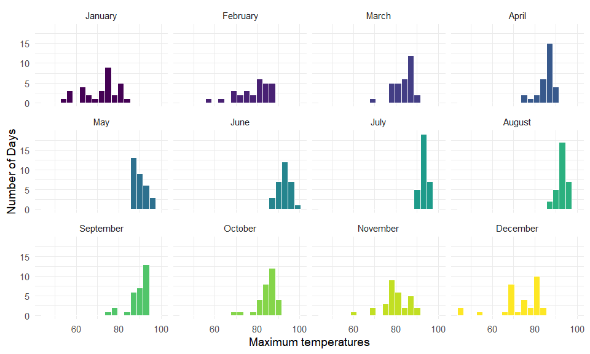
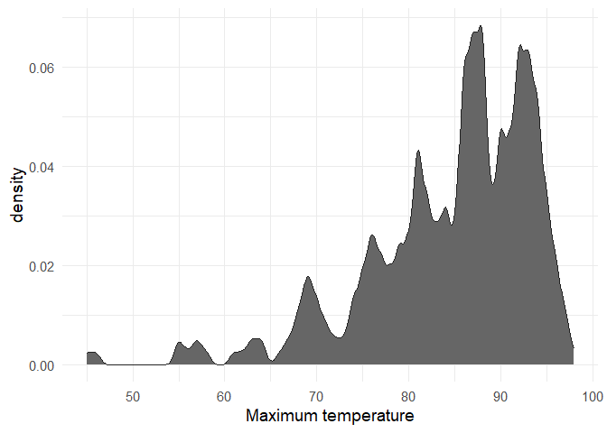
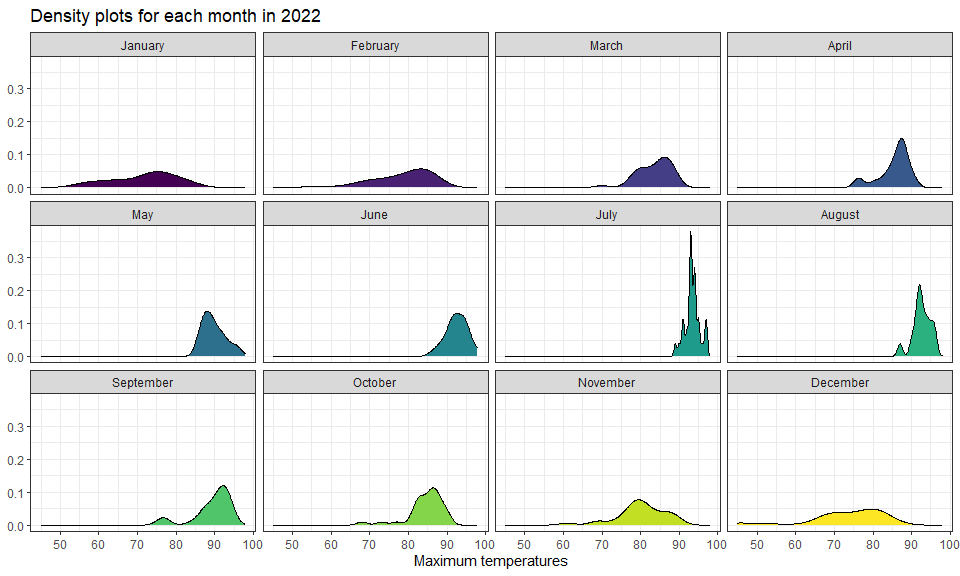
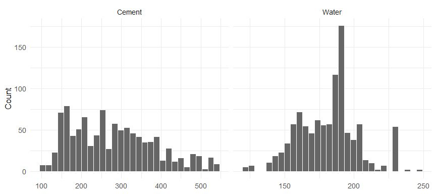
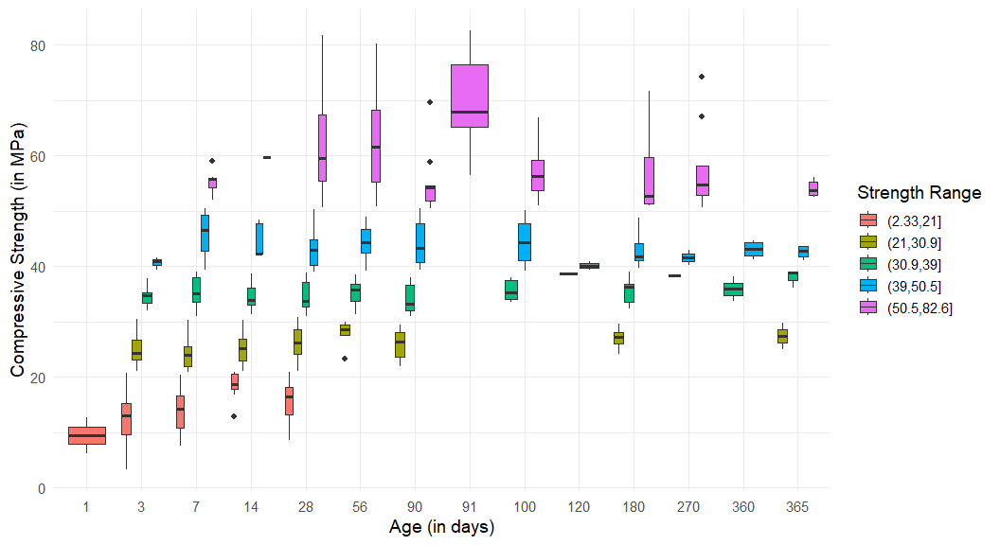
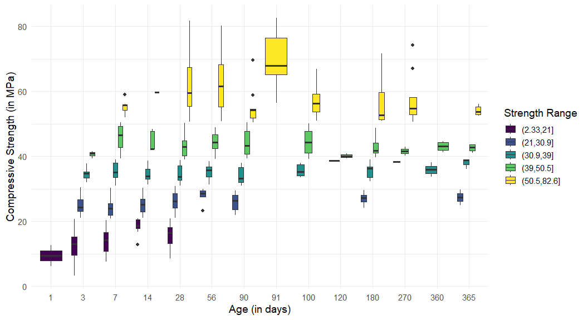
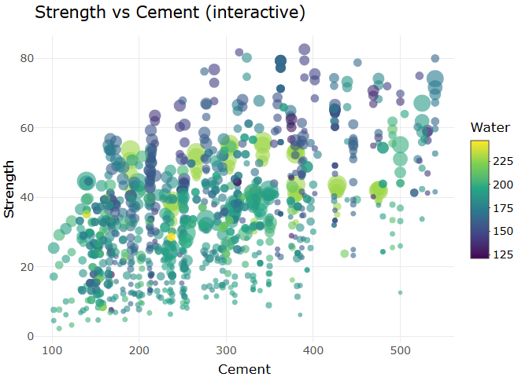

Data Visualization for Exploratory Data Analysis
================
Jan Tietz `jtietz3060@floridapoly.edu`

# Data Visualization Project 03

In this exercise you will explore methods to create different types of
data visualizations (such as plotting text data, or exploring the
distributions of continuous variables).

## PART 1: Density Plots

Using the dataset obtained from FSU’s [Florida Climate
Center](https://climatecenter.fsu.edu/climate-data-access-tools/downloadable-data),
for a station at Tampa International Airport (TPA) for 2022, attempt to
recreate the charts shown below which were generated using data from
2016. You can read the 2022 dataset using the code below:

``` r
library(tidyverse)
library(plotly)
library(ggridges)
library(ggplot2)
weather_tpa <- read_csv("https://raw.githubusercontent.com/aalhamadani/datasets/master/tpa_weather_2022.csv")
weather_tpa <- weather_tpa %>%
  mutate(month_name = factor(month.name[month], levels = month.name))
# random sample 
sample_n(weather_tpa, 4)
```

    ## # A tibble: 4 × 8
    ##    year month   day precipitation max_temp min_temp ave_temp month_name
    ##   <dbl> <dbl> <dbl>         <dbl>    <dbl>    <dbl>    <dbl> <fct>     
    ## 1  2022     2     7       0             70       54     62   February  
    ## 2  2022    10    28       0.71          87       72     79.5 October   
    ## 3  2022    10    17       0.00001       86       75     80.5 October   
    ## 4  2022     7    20       0             93       83     88   July

See Slides from Week 4 of Visualizing Relationships and Models (slide
10) for a reminder on how to use this type of dataset with the
`lubridate` package for dates and times (example included in the slides
uses data from 2016).

Using the 2022 data:

1)  Create a plot like the one below:


``` r
ggplot(weather_tpa, aes(x = max_temp, fill = month_name)) +
  geom_histogram(color = "white", binwidth = 3, show.legend = FALSE) +
  facet_wrap(~ month_name, nrow = 3, ncol = 4) +
  scale_fill_viridis_d(option = "viridis") +
  theme_minimal(base_size = 14) +
  labs(
    x = "Maximum temperatures",
    y = "Number of Days"
  )
```



Hint: the option `binwidth = 3` was used with the `geom_histogram()`
function.

2)  Create a plot like the one below:


``` r
ggplot(weather_tpa, aes(x = max_temp)) +
  geom_density(fill = "grey40", color = "#222222", bw = 0.5, kernel = "gaussian") +
  theme_minimal(base_size = 14) +
  labs(
    x = "Maximum temperature",
    y = "density"
  )
```



Hint: check the `kernel` parameter of the `geom_density()` function, and
use `bw = 0.5`.

3)  Create a plot like the one below:


``` r
ggplot(weather_tpa, aes(x = max_temp, fill = month_name)) +
  geom_density() +
  facet_wrap(~ month_name, ncol = 4) +
  scale_fill_viridis_d() +
  labs(title = "Density plots for each month in 2022",
       x = "Maximum temperatures", y = NULL) +
  theme_bw() +
  theme(legend.position = "none")
```



Hint: default options for `geom_density()` were used.

4)  Generate a plot like the chart below:


``` r
ggplot(weather_tpa, aes(x = max_temp, y = month_name, fill = after_stat(x))) +
  geom_density_ridges_gradient(quantile_lines = TRUE, quantiles = 2) +
  scale_fill_viridis_c(option = "plasma", name = "Max temp") +
  labs(title = "Maximum temperature by month (2022)",
       x = "Maximum temperature", y = "Month") +
    xlim(50, 100) +
  theme_ridges()
```

    ## Picking joint bandwidth of 1.87


Hint: use the`{ggridges}` package, and the `geom_density_ridges()`
function paying close attention to the `quantile_lines` and `quantiles`
parameters. The plot above uses the `plasma` option (color scale) for
the *viridis* palette.

5)  Create a plot of your choice that uses the attribute for
    precipitation *(values of -99.9 for temperature or -99.99 for
    precipitation represent missing data)*.

## PART 2

### Option (B): Data on Concrete Strength

Concrete is the most important material in **civil engineering**. The
concrete compressive strength is a highly nonlinear function of *age*
and *ingredients*. The dataset used here is from the [UCI Machine
Learning Repository](https://archive.ics.uci.edu/ml/index.php), and it
contains 1030 observations with 9 different attributes 9 (8 quantitative
input variables, and 1 quantitative output variable). A data dictionary
is included below:

| Variable                      | Notes                 |
|-------------------------------|-----------------------|
| Cement                        | kg in a $m^3$ mixture |
| Blast Furnace Slag            | kg in a $m^3$ mixture |
| Fly Ash                       | kg in a $m^3$ mixture |
| Water                         | kg in a $m^3$ mixture |
| Superplasticizer              | kg in a $m^3$ mixture |
| Coarse Aggregate              | kg in a $m^3$ mixture |
| Fine Aggregate                | kg in a $m^3$ mixture |
| Age                           | in days               |
| Concrete compressive strength | MPa, megapascals      |

Below we read the `.csv` file using `readr::read_csv()` (the `readr`
package is part of the `tidyverse`)

``` r
concrete <- read_csv("../data/concrete.csv", col_types = cols())
```

Let us create a new attribute for visualization purposes,
`strength_range`:

``` r
new_concrete <- concrete %>%
  mutate(strength_range = cut(Concrete_compressive_strength, 
                              breaks = quantile(Concrete_compressive_strength, 
                                                probs = seq(0, 1, 0.2))) )
head(new_concrete)
```

    ## # A tibble: 6 × 10
    ##   Cement Blast_Furnace_Slag Fly_Ash Water Superplasticizer Coarse_Aggregate
    ##    <dbl>              <dbl>   <dbl> <dbl>            <dbl>            <dbl>
    ## 1   540                  0        0   162              2.5            1040 
    ## 2   540                  0        0   162              2.5            1055 
    ## 3   332.               142.       0   228              0               932 
    ## 4   332.               142.       0   228              0               932 
    ## 5   199.               132.       0   192              0               978.
    ## 6   266                114        0   228              0               932 
    ## # ℹ 4 more variables: Fine_Aggregate <dbl>, Age <dbl>,
    ## #   Concrete_compressive_strength <dbl>, strength_range <fct>

1.  Explore the distribution of 2 of the continuous variables available
    in the dataset. Do ranges make sense? Comment on your findings.

``` r
concrete %>%
  select(Cement, Water) %>%
  pivot_longer(everything(), names_to = "variable", values_to = "value") %>%
  ggplot(aes(x = value)) +
  geom_histogram(bins = 30, fill = "grey40", color = "white") +
  facet_wrap(~ variable, scales = "free_x") +
  labs(x = NULL, y = "Count") +
  theme_minimal(base_size = 13)
```



### Data Plausibility Check

The value ranges for both variables are highly reasonable
($\text{kg/m}^3$):

- **Cement ($100\text{–}540 \text{ kg/m}^3$):** Realistic. Standard
  concrete uses $250\text{–}400 \text{ kg/m}^3$. Low values represent
  lean concrete, while values above $500 \text{ kg/m}^3$ are used for
  high-strength mixes.
- **Water ($120\text{–}250 \text{ kg/m}^3$):** Plausible. The peak
  between $150$ and $200 \text{ kg/m}^3$ matches the typical water
  requirement per cubic meter. Higher values are rare because too much
  water ruins the concrete’s stability.

**Conclusion:** The peaks show a typical water-to-cement ratio
($\text{w/c}$) of about $\frac{180}{300} = 0.6$, which is the industry
standard. The data has no outliers or unit errors and is ready for
modeling.

2.  Use a *temporal* indicator such as the one available in the variable
    `Age` (measured in days). Generate a plot similar to the one shown
    below. Comment on your results.


``` r
#Old plot with bad colors
new_concrete %>%
  filter(!is.na(strength_range)) %>%
  ggplot(aes(x = factor(Age), y = Concrete_compressive_strength,
             fill = strength_range)) +
  geom_boxplot() +
  labs(x = "Age (in days)", y = "Compressive Strength (in MPa)",
       fill = "Strength Range") +
  theme_minimal(base_size = 14)
```



The colors in the original plot are hard to differentiate. I notice this
myself because I am colorblind. Switching to the viridis palette makes
the groups much easier to tell apart, and because viridis runs from dark
to bright, the ordered strength ranges now read in order: dark means a
low range and yellow means a high one.

``` r
new_concrete %>%
  filter(!is.na(strength_range)) %>%
  ggplot(aes(x = factor(Age), y = Concrete_compressive_strength,
             fill = strength_range)) +
  geom_boxplot() +
  scale_fill_viridis_d() +
  labs(x = "Age (in days)", y = "Compressive Strength (in MPa)",
       fill = "Strength Range") +
  theme_minimal(base_size = 14)
```


The plot shows that concrete at a low age generally has low compressive
strength with little variability. As the age increases, the strength
rises, with the best values around 90 days, where the median is high and
the spread reaches well upward. Beyond 90 days the strength levels off
and even drops slightly again.

3.  Create a scatterplot similar to the one shown below. Pay special
    attention to which variables are being mapped to specific aesthetics
    of the plot. Comment on your results.


``` r
p <- concrete %>%
  ggplot(aes(x = Cement, y = Concrete_compressive_strength,
             color = Water, size = Age,
             text = paste0("Cement: ", Cement,
                           "<br>Strength: ", round(Concrete_compressive_strength, 1),
                           "<br>Water: ", Water,
                           "<br>Age: ", Age, " days"))) +
  geom_point(alpha = 0.6) +
  scale_color_viridis_c() +
  labs(title = "Strength vs Cement (interactive)",
       x = "Cement", y = "Strength", color = "Water", size = "Age") +
  theme_minimal(base_size = 13)

ggplotly(p, tooltip = "text")
```



The scatterplot reveals how concrete strength depends on cement, water,
and curing time:

- **Cement:** Clear positive trend. More cement increases the
  compressive strength.
- **Water:** Less water makes the concrete stronger. The strongest mixes
  (at the top) are dark purple ($125\text{–}150\text{ kg/m}^3$). Too
  much water (yellow/green dots) keeps the strength low, even with a lot
  of cement.
- **Age:** Concrete needs time to cure. Young concrete (small dots) has
  very little strength and stays under 40. The absolute highest strength
  values ($\ge 80$) are only reached by old concrete (largest dots, up
  to 300 days).

**Conclusion:** The strongest concrete requires a combination of high
cement, low water content, and maximum curing time.
