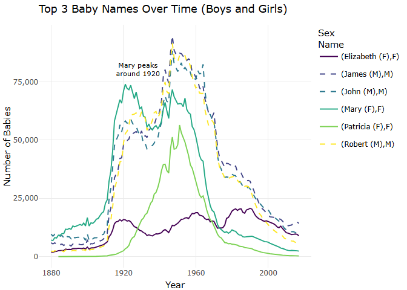
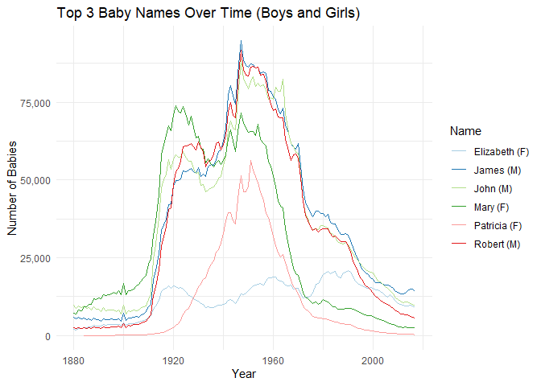
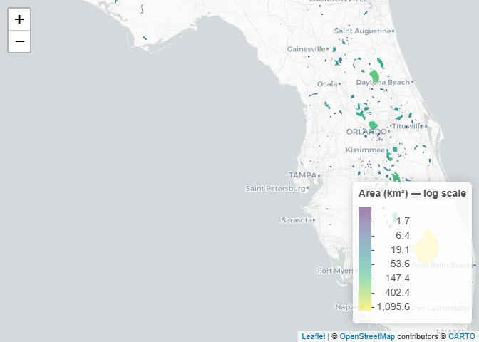
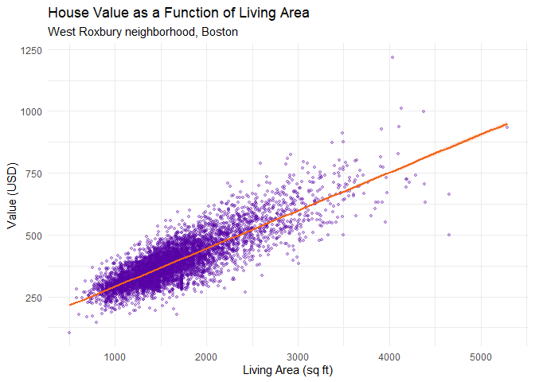
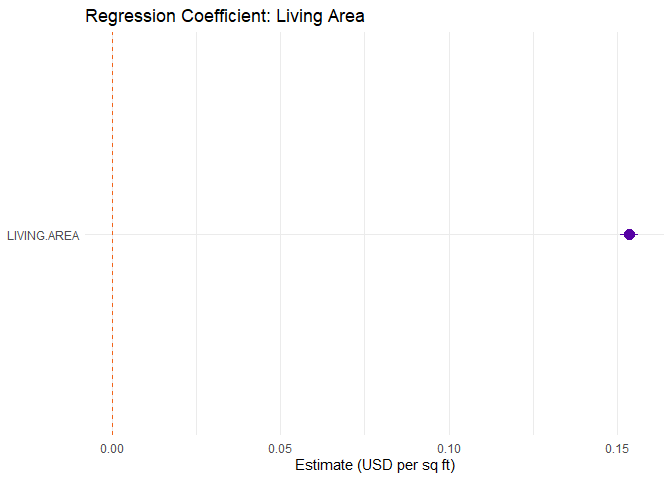
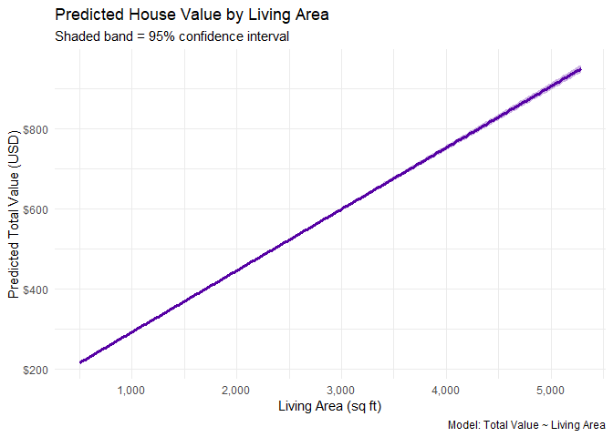

Data Visualization Mini-Project 2
================
Jan Tietz - <jtietz3060@floridapoly.edu>

# Setup

``` r
library(tidyverse)
library(readr)
library(sf)
library(plotly)
library(htmlwidgets)
library(broom)
library(leaflet)
library(leaflet.extras)
```

``` r
babys  <- readRDS("../data/babynames.rds")
lakes  <- st_read("../data/Florida_Lakes.shp", quiet = TRUE)
houses <- read_csv("../data/WestRoxbury.csv")
```

------------------------------------------------------------------------

# Plot 1: Interactive Timeline of the Most Popular Baby Names

## Initial Idea

I wanted to see how the most popular baby names change over time. My
plan was to find the 3 most frequently used names for boys and the 3 for
girls across all years combined, and then draw an interactive line chart
so you can hover over any year and see the exact count.

``` r
# Find the top 3 names for each sex by total count across all years
top_names <- babys %>%
  group_by(sex, name) %>%
  summarise(total = sum(n)) %>%
  group_by(sex) %>%
  slice_max(order_by = total, n = 3) %>%
  ungroup()

# Keep only those names in the full time series
timeline_data <- babys %>%
  semi_join(top_names, by = c("sex", "name")) %>%
  mutate(label = paste0(name, " (", sex, ")"))
```

``` r
# Build the static ggplot first, then make it interactive with ggplotly()
p1 <- ggplot(data = timeline_data, aes(x = year, y = n, color = label, linetype = sex, group = label,
    text  = paste0(
      "Name: ", name, "\n",
      "Sex: ",  sex,  "\n",
      "Year: ", year, "\n",
      "Count: ", scales::comma(n)
    )
  )
) +
  geom_line() +
  annotate(
    "text",
    x     = 1928,
    y     = 80000,
    label = "Mary peaks\naround 1920",
    color = "black",
    size  = 3,
    hjust = 0
  ) +
  annotate(
    "curve",
    x         = 1927, xend = 1921,
    y         = 78000, yend = 73000,
    arrow     = arrow(length = unit(0.2, "cm"), type = "closed"),
    color     = "black",
    curvature = -0.3
  ) +
  scale_y_continuous(labels = scales::comma) +
  scale_color_viridis_d(option = "viridis") +
  labs(
    title   = "Top 3 Baby Names Over Time (Boys and Girls)",
    x       = "Year",
    y       = "Number of Babies",
    color    = "Name",
    linetype = "Sex"
  ) +
  theme_minimal()

interactive_p1 <- ggplotly(p1, tooltip = "text")

# Save a self-contained HTML version
saveWidget(interactive_p1, "./plot1_names_timeline.html",
           selfcontained = TRUE)

interactive_p1
```



The interactive chart above is a redesign of my original Plot 1. For
comparison, here is the original version as I first submitted it.

``` r
p1_original <- ggplot(timeline_data,
                      aes(x = year, y = n, color = label, group = label)) +
  geom_line() +
  scale_y_continuous(labels = scales::comma) +
  scale_color_brewer(palette = "Paired") +
  labs(
    title = "Top 3 Baby Names Over Time (Boys and Girls)",
    x     = "Year",
    y     = "Number of Babies",
    color = "Name"
  ) +
  theme_minimal()

p1_original
```



- **What I redesigned:** The original version above used the
  RColorBrewer “Paired” palette and encoded sex through color only.
  Under my own color blindness (deuteranopia) the paired light and dark
  hues collapse into near-identical colors, and the boys-versus-girls
  grouping disappears. The redesign switches to **viridis** and adds
  **line type** as a second channel for sex, so the same information
  stays readable with reduced or no color perception. The data and the
  message are unchanged; only the accessibility improves.

## Story

The six lines cluster into two clear groups. Female names peak earlier
and more sharply: Mary dominated the early decades of the dataset and
then fell steadily as naming tastes diversified, while Jennifer exploded
in the 1970s before dropping off just as fast. The male names show a
similar rise-and-fall shape but tend to peak later and sustain higher
counts for longer. James and Robert were both enormously popular through
the mid-twentieth century, with the kind of broad, stable usage that
kept them in the top three even as individual years went to other names.
What stands out most is that no name holds its position permanently.
Every peak is followed by a decline, which suggests that popularity
itself feeds eventual exhaustion of a name. The elevated counts in the
1950s and 1960s coincide with the Baby Boom, a period of unusually high
birth rates in the United States following World War II.

## Principles Applied

- **Interactivity via plotly:** I used `ggplotly()` to turn the static
  `ggplot2` object into an interactive chart. A static line chart only
  shows the overall shape of each curve; here the reader can hover over
  any point to read the exact name, sex, year, and count, follow a
  single name across years without guessing values off the axis, and
  isolate one line by clicking its legend entry. None of that is
  possible in a printed image.

- **Colorblind-safe encoding:** The lines use the **viridis** discrete
  palette, which stays legible under red-green color blindness
  (deuteranopia). Sex is encoded a second time through **line type**, so
  the boys versus girls distinction never relies on color alone.

# Plot 2: Spatial Visualization of Florida Lakes by Surface Area

## Initial Idea

I wanted to put the Florida lakes on an interactive map and encode the
surface area through color, so larger lakes stand out immediately.
Because I am color blind (deuteranopia, red-green color blindness), I
chose the **viridis** palette. Viridis is specifically designed to be
perceptually uniform and readable for the most common forms of color
blindness. Rather than a static `ggplot2` map, I used **leaflet** to
make the visualization fully interactive: users can zoom in freely, pan
across the state, and hover over any lake polygon to see its name and
exact surface area in a tooltip.

``` r
# The shapefile already contains SHAPEAREA (in square meters).
# Convert to square kilometers for a more readable legend.
lakes_plot <- lakes %>%
  mutate(area_km2 = SHAPEAREA / 1e6)
```

``` r
# Reproject to WGS 84 (EPSG:4326) as required by leaflet
lakes_wgs84 <- st_transform(lakes_plot, crs = 4326)

# Build a log-scaled viridis colour palette matching the original design
pal <- colorNumeric(
  palette = "viridis",
  domain  = log1p(lakes_wgs84$area_km2),
  na.color = "transparent"
)

# Hover tooltip: lake name + area rounded to 2 decimal places
tooltip_html <- paste0(
  "<strong>", lakes_wgs84$LAKE_NAME, "</strong><br/>",
  "Area: ", round(lakes_wgs84$area_km2, 2), " km\u00b2"
)

p2 <- leaflet(lakes_wgs84,
              options = leafletOptions(minZoom = 6)) %>%
  # Restrict pan to Florida's bounding box
  setMaxBounds(lng1 = -87.6, lat1 = 24.5,
               lng2 = -80.0, lat2 = 31.0) %>%
  setView(lng = -81.5, lat = 28.0, zoom = 7) %>%
  addProviderTiles(providers$CartoDB.Positron) %>%
  addPolygons(
    fillColor   = ~pal(log1p(area_km2)),
    fillOpacity = 0.85,
    color       = NA,         
    weight      = 0,
    label       = lapply(tooltip_html, htmltools::HTML),
    labelOptions = labelOptions(
      style     = list("font-size" = "13px"),
      direction = "auto"
    ),
    highlightOptions = highlightOptions(
      fillOpacity = 1,
      bringToFront = TRUE
    )
  ) %>%
  addLegend(
    position = "bottomright",
    pal      = pal,
    values   = ~log1p(area_km2),
    title    = "Area (km\u00b2) \u2014 log scale",
    labFormat = labelFormat(
      transform = function(x) round(expm1(x), 1)
    )
  )

# Save self-contained HTML export
#saveWidget(p2, "./plot2_lakes_interactive.html",
#           selfcontained = TRUE)

p2
```



## Story

Florida’s lakes are not spread evenly across the state. The map shows a
clear concentration in the central peninsula, particularly in Polk and
Orange counties, which sit on top of the karst limestone geology that
produces sinkholes and lake basins. The panhandle and the southern tip
are comparatively sparse. Most lakes are tiny: the legend scale is
logarithmic, and the bulk of the state shows the dark end of the viridis
palette. The bright yellow outliers, which are Lake Okeechobee in the
south and a handful of large lakes in the central ridge, are genuinely
exceptional in size relative to the rest of the distribution.

## Principles Applied

- **Interactive spatial visualization with leaflet:** The map is built
  with the `leaflet` package instead of static `ggplot2 + geom_sf()`.
  The interactivity is what makes the data usable: the lakes span a
  whole state but many are tiny, so a static image either shows the
  whole state and loses the small lakes, or zooms in and loses the
  context. Here the reader can zoom and pan freely to any region and
  hover over any single lake to read its exact name and surface area,
  which a fixed image cannot offer.
- **Hover tooltips:** Tooltip on hover showing the lake name and its
  surface area.
- **Color-blind-friendly palette:** The **viridis** color scale is
  applied, preserving the same perceptual uniformity and accessibility
  as the original design.
- **Log transformation on the fill scale:** Lake areas span several
  orders of magnitude. Applying `log1p()` before mapping to color
  prevents the handful of very large lakes from washing out all contrast
  for medium and small lakes.
- **Removing polygon borders** (`color = NA, weight = 0`) reduces visual
  clutter when many small polygons are displayed close together,
  identical to the original.
- **CartoDB Positron basemap:** A neutral greyscale tile layer provides
  geographic context (coastline, county shapes) without competing with
  the viridis fill colors.

------------------------------------------------------------------------

# Plot 3: Linear Regression of House Value on Living Area

## Initial Idea

The West Roxbury dataset contains house prices and living area in square
feet. My idea was to fit a simple linear regression predicting
`TOTAL.VALUE` from `LIVING.AREA`, visualize the regression line with a
confidence band using `geom_smooth()`, and then also produce a
**coefficient plot** showing the model estimates with their 95 %
confidence intervals.

``` r
cat("Rows:", nrow(houses), " | Columns:", ncol(houses))
```

    ## Rows: 5802  | Columns: 14

``` r
# Column names in this CSV contain spaces (e.g. "TOTAL VALUE", "LIVING AREA").
# Replace spaces with dots so R can reference them without backticks.
houses_clean <- houses %>%
  rename_with(~ str_replace_all(., " ", ".")) %>%
  filter(!is.na(TOTAL.VALUE), !is.na(LIVING.AREA))

# Fit simple linear regression: Total Value ~ Living Area
house_model <- lm(TOTAL.VALUE ~ LIVING.AREA, data = houses_clean)

# Inspect model coefficients and fit statistics with broom
tidy(house_model, conf.int = TRUE)
```

    ## # A tibble: 2 × 7
    ##   term        estimate std.error statistic p.value conf.low conf.high
    ##   <chr>          <dbl>     <dbl>     <dbl>   <dbl>    <dbl>     <dbl>
    ## 1 (Intercept)  138.      2.30         60.1       0  134.      143.   
    ## 2 LIVING.AREA    0.154   0.00132     117.        0    0.151     0.156

``` r
glance(house_model)
```

    ## # A tibble: 1 × 12
    ##   r.squared adj.r.squared sigma statistic p.value    df  logLik    AIC    BIC
    ##       <dbl>         <dbl> <dbl>     <dbl>   <dbl> <dbl>   <dbl>  <dbl>  <dbl>
    ## 1     0.701         0.701  54.3    13583.       0     1 -31403. 62813. 62833.
    ## # ℹ 3 more variables: deviance <dbl>, df.residual <int>, nobs <int>

``` r
# 3a: Scatter plot with the regression line
p3a <- ggplot(houses_clean, aes(x = LIVING.AREA, y = TOTAL.VALUE)) +
  geom_point(alpha = 0.3, color = "#5601A4", size = 1.2) +
  geom_smooth(method = "lm", formula = "y ~ x",
              color = "#F26419", fill = "#F26419", alpha = 0.2) +
  labs(
    title    = "House Value as a Function of Living Area",
    subtitle = "West Roxbury neighborhood, Boston",
    x        = "Living Area (sq ft)",
    y        = "Value (USD)"
  ) +
  theme_minimal()

p3a
```



``` r
# 3b: Coefficient plot
house_coefs <- tidy(house_model, conf.int = TRUE) %>%
  filter(term != "(Intercept)")

p3b <- ggplot(house_coefs,
              aes(x = estimate, y = fct_rev(term))) +
  geom_pointrange(aes(xmin = conf.low, xmax = conf.high),
                  color = "#5601A4", size = 0.8) +
  geom_vline(xintercept = 0, color = "#F26419", linetype = "dashed") +
  scale_x_continuous(labels = scales::comma) +
  labs(
    title    = "Regression Coefficient: Living Area",
    x        = "Estimate (USD per sq ft)",
    y        = NULL
  ) +
  theme_minimal()

p3b
```



``` r
# 3c: Marginal effects plot — predicted value across a range of living areas
new_areas <- tibble(LIVING.AREA = seq(
  min(houses_clean$LIVING.AREA, na.rm = TRUE),
  max(houses_clean$LIVING.AREA, na.rm = TRUE),
  length.out = 200
))

predicted_values <- augment(house_model, newdata = new_areas, se_fit = TRUE)

p3c <- ggplot(predicted_values, aes(x = LIVING.AREA, y = .fitted)) +
  geom_ribbon(
    aes(ymin = .fitted + (-1.96 * .se.fit),
        ymax = .fitted + ( 1.96 * .se.fit)),
    fill  = "#5601A4", alpha = 0.3
  ) +
  geom_line(color = "#5601A4", linewidth = 1.2) +
  scale_x_continuous(labels = scales::comma) +
  scale_y_continuous(labels = scales::dollar) +
  labs(
    title    = "Predicted House Value by Living Area",
    subtitle = "Shaded band = 95% confidence interval",
    x        = "Living Area (sq ft)",
    y        = "Predicted Total Value (USD)",
    caption  = "Model: Total Value ~ Living Area"
  ) +
  theme_minimal()

p3c
```



## Story

The scatter plot shows a clear relationship : larger houses are worth
more, and the trend is consistent enough that a straight line captures
it well. The coefficient plot puts a number on it. Each additional
square foot is associated with roughly \$155 in total assessed value,
and the confidence interval is narrow enough that the estimate is
precise. The marginal effects plot shows the same information in a more
readable form: going from a 1,000 sq ft house to a 3,000 sq ft house
roughly doubles the predicted value. The residual scatter around the
line is wide though, which means living area explains a good portion of
the variance but is far from the whole story. Other factors like lot
size, number of floors, or year built would reduce that spread.

## Principles Applied

- **Consistent color scheme** across all three sub-plots (purple and
  orange) reinforces that they belong to the same analysis.

------------------------------------------------------------------------

# Discussion

## What charts did I plan and what cleaning was needed?

I planned three visualizations: (1) an interactive time-series of baby
names, (2) an interactive choropleth map of Florida lakes with hover
tooltips, and (3) a regression model of house values. The baby names RDS
was already tidy. The shapefile already contains a `SHAPEAREA` column in
square meters, which we converted to square kilometers directly, and
then reprojected to WGS 84 (EPSG:4326) as required by leaflet. The West
Roxbury CSV uses spaces in its column names, so `rename_with()` was used
to replace spaces with dots before modelling.

## What story do the plots tell?

The baby names chart shows that naming trends move in long waves: names
rise fast, dominate for a generation, and then fall off as the next wave
comes in. The lakes map shows that Florida’s lakes are geographically
concentrated in the central karst belt and are small, with a handful of
outliers that dwarf the rest. The regression plots confirm a strong
positive relationship between house size and assessed value in West
Roxbury, though the scatter around the line is wide enough to suggest
that size alone is not a complete predictor of price.

## Additional Approaches

As an additional approach to explore the data, future analyses could use
a multiple regression model to investigate which other variables, such
as year built, significantly influence house prices.

## How were visualization principles applied?

- **Interactivity** Hover tooltips and zoom are used in Plot 1 (plotly)
  and Plot 2 (leaflet) so readers can explore individual data points and
  lake polygons directly.
- **Spatial encoding** Geographic position and color hue encode two
  dimensions of the lake data simultaneously.
- **Model visualization** All three sub-plots for the regression model
  follow the coefficient plot and marginal effects workflow.
- **Color accessibility:** viridis palette in Plot 2 and a single-hue
  scheme in Plot 3 ensure readability for color-blind readers.
